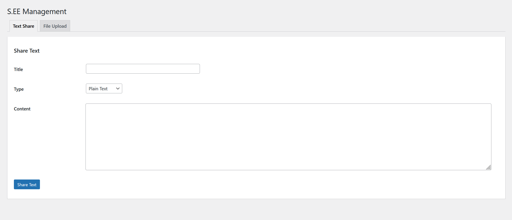
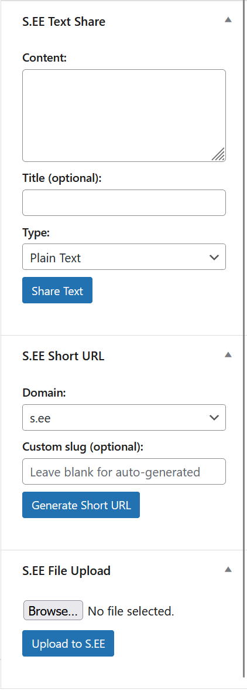

# S.EE URL Shortener, Text & File Sharing for WordPress

Integrate [S.EE](https://s.ee) URL shortener, text sharing, and file hosting into your WordPress site.

## Features

- **URL Shortening** - Generate short URLs for posts and pages using your custom S.EE domains
- **Auto Shorten** - Automatically create short URLs when you publish a post or page
- **Text Sharing** - Share text snippets as plain text, Markdown, or source code
- **File Upload** - Upload files from the Media Library or post editor sidebar, with one-click copy in URL, HTML, Markdown, and BBCode formats
- **Auto Upload** - Optionally auto-upload all new media to S.EE
- **Post List Integration** - View and copy short URLs directly from the Posts/Pages list
- **Management Dashboard** - Standalone tools for text sharing and file uploads with history tracking

## Screenshots

| Settings | Management | Post Editor |
|----------|------------|-------------|
|  |  |  |

## Requirements

- PHP 8.1+
- WordPress 6.0+
- An [S.EE](https://s.ee) account and API key

## Installation

1. Download the [latest release](https://github.com/sdotee/see-wordpress/releases) and upload the `see` folder to `/wp-content/plugins/`, or install via Composer:
   ```bash
   cd wp-content/plugins/see
   composer install
   ```
2. Activate the plugin in **Plugins > Installed Plugins**.
3. Go to **Settings > S.EE** and enter your API key.
4. Click **Test Connection** to verify.
5. Select your default domains and configure automation options.

## Configuration

### API Key

You can configure the API key in two ways:

- **Settings page**: Settings > S.EE > API Configuration
- **wp-config.php** (takes priority):
  ```php
  define( 'SEE_API_KEY', 'your-api-key-here' );
  ```

### Custom API Base URL

Default: `https://s.ee/api/v1/`

Override in wp-config.php:
```php
define( 'SEE_API_BASE_URL', 'https://your-custom-endpoint/api/v1/' );
```

## Languages

English, 简体中文, 繁體中文, 日本語, 한국어, Bahasa Indonesia, Tiếng Việt, Deutsch, Fran&ccedil;ais, Espa&ntilde;ol, Portugu&ecirc;s, Portugu&ecirc;s do Brasil, Русский

## License

[MIT](LICENSE)
