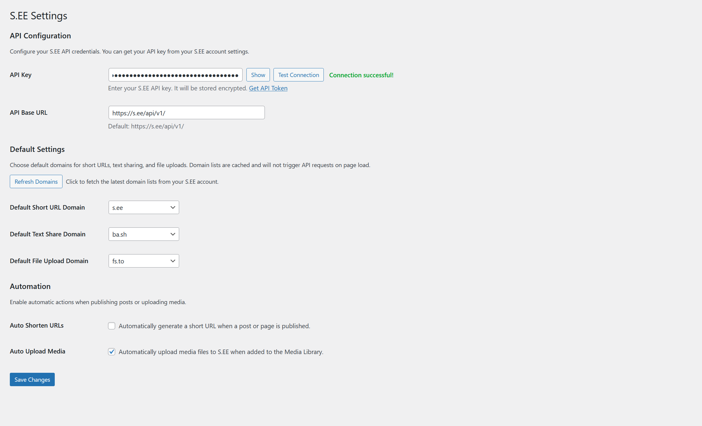
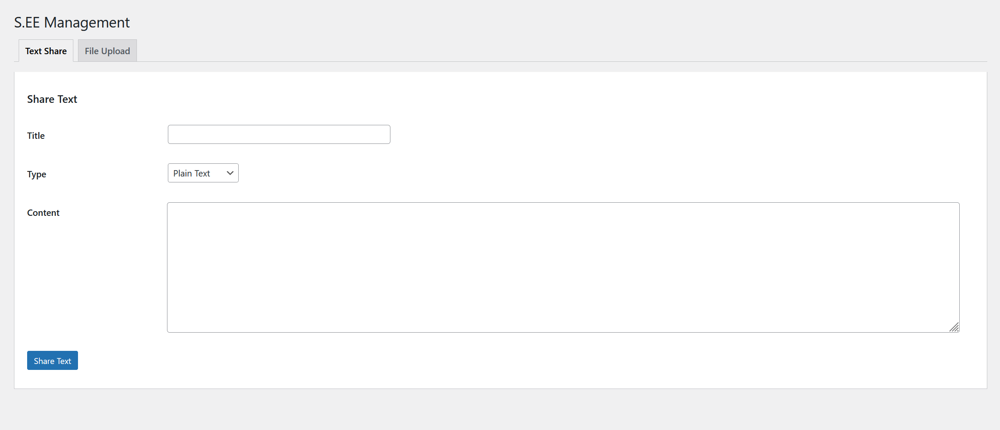
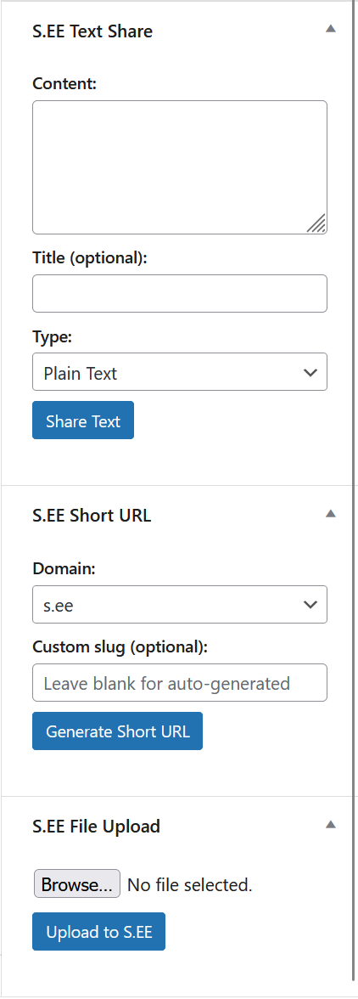

# S.EE URL Shortener, Text & File Sharing for WordPress

[](https://wordpress.org/)
[](https://www.php.net/)
[](LICENSE)

Integrate [S.EE](https://s.ee) URL shortener, text sharing, and file hosting into your WordPress site.

## Features

- **URL Shortening** — Generate short URLs for posts and pages using your custom S.EE domains
- **Auto Shorten** — Automatically create short URLs when you publish a post or page
- **Text Sharing** — Share text snippets as plain text, Markdown, or source code
- **File Upload** — Upload files from the Media Library or post editor sidebar, with one-click copy in URL, HTML, Markdown, and BBCode formats
- **Auto Upload** — Optionally auto-upload all new media to S.EE
- **Post List Integration** — View and copy short URLs directly from the Posts/Pages list
- **Management Dashboard** — Standalone tools for text sharing and file uploads with history tracking
- **13 Languages** — English, 简体中文, 繁體中文, 日本語, 한국어, Bahasa Indonesia, Tiếng Việt, Deutsch, Français, Español, Português, Português do Brasil, Русский

## Screenshots

| Settings | Management | Post Editor |
|----------|------------|-------------|
|  |  |  |

## Requirements

- PHP 8.2+
- WordPress 6.0+
- An [S.EE](https://s.ee) account and API key

## Installation

### From WordPress.org

Search for **S.EE** in **Plugins > Add New** and click **Install Now**.

### From GitHub Release

Download `sdotee-x.x.x.zip` from the [latest release](https://github.com/sdotee/see-wordpress/releases), then go to **Plugins > Add New > Upload Plugin** and upload the zip file.

### From Source

```bash
git clone https://github.com/sdotee/see-wordpress.git
cp -r see-wordpress/sdotee wp-content/plugins/
cd wp-content/plugins/sdotee
composer install
```

Then:
1. Activate the plugin in **Plugins > Installed Plugins**.
2. Go to **Settings > S.EE** and enter your API key.
3. Click **Test Connection** to verify.
4. Select your default domains and configure automation options.

## Configuration

### API Key

You can configure the API key in two ways:

- **Settings page**: Settings > S.EE > API Configuration
- **wp-config.php** (takes priority):
  ```php
  define( 'SDOTEE_API_KEY', 'your-api-key-here' );
  ```

### Custom API Base URL

Default: `https://s.ee/api/v1/`

Override in wp-config.php:
```php
define( 'SDOTEE_API_BASE_URL', 'https://your-custom-endpoint/api/v1/' );
```

## Changelog

### 1.0.3
- Rename all prefixes from `see_`/`SEE_` to `sdotee_`/`SDOTEE_` for WordPress.org compliance (minimum 4-character unique prefix)
- Rename plugin directory from `see` to `sdotee`
- Add share page URL to file upload results
- Add external services documentation to readme.txt per Guideline 6
- Fix `sanitize_api_key` callback to handle non-scalar input gracefully
- Move WordPress.org directory assets out of plugin zip

### 1.0.2
- Change plugin text domain from `see` to `sdotee` for WordPress.org compatibility

### 1.0.1
- Bump minimum PHP version from 8.1 to 8.2 (PHP 8.1 has reached end of life)

### 1.0.0
- Initial release

## License

[MIT](LICENSE)
